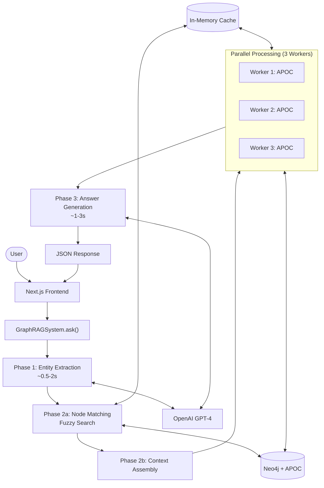

# GraphQuery-LLM 🚀

> **Intelligent Graph-Based Question Answering System powered by Neo4j, APOC, and OpenAI GPT-4**

GraphQuery-LLM is a high-performance Graph Retrieval-Augmented Generation (Graph RAG) system that combines the power of knowledge graphs with large language models to provide accurate, context-aware answers to complex questions.

[](https://www.python.org/downloads/)
[](https://neo4j.com/)
[](https://openai.com/)
[](https://opensource.org/licenses/MIT)

---

## 🌟 Features

- **🧠 Intelligent Entity Extraction**: Automatically identifies relevant entities from natural language questions using LLM
- **🔍 Fuzzy Node Matching**: Finds matching nodes in Neo4j graph using exact and fuzzy search strategies
- **🕸️ Multi-hop Graph Traversal**: Leverages APOC procedures for efficient subgraph exploration
- **⚡ Parallel Processing**: ThreadPoolExecutor for concurrent subgraph queries (up to 3 workers)
- **💾 Smart Caching**: In-memory caching for schemas, node matches, and subgraphs to reduce redundant queries
- **📊 Detailed Performance Metrics**: Track timing for each pipeline stage with comprehensive breakdowns
- **🎯 Context-Aware Answers**: Generates answers based on actual graph relationships with path visualization

---

## 📋 Table of Contents

- [Architecture](#-architecture)
- [Installation](#-installation)
- [Quick Start](#-quick-start)
- [Configuration](#-configuration)
- [Usage Examples](#-usage-examples)
- [Performance Metrics](#-performance-metrics)
- [System Architecture](#-system-architecture)
- [API Reference](#-api-reference)
- [Optimization Tips](#-optimization-tips)
- [Contributing](#-contributing)
- [License](#-license)

---

## 🏗️ Architecture

GraphQuery-LLM processes questions through a 3-phase pipeline:
```
User Question → Entity Extraction → Context Assembly → Answer Generation → Response
```

### Pipeline Stages

1. **Entity Extraction** (~0.5-2s)
   - LLM extracts potential entities from question
   - Uses cached Neo4j schema for context
   - Limits to 5 entities for performance

2. **Context Assembly** (~2-5s)
   - Parallel node matching with fuzzy search
   - APOC subgraph traversal (max depth: 5, max nodes: 100)
   - ThreadPoolExecutor with 3 workers
   - Comprehensive caching layer

3. **Answer Generation** (~1-3s)
   - Formats subgraphs for LLM consumption
   - Context-aware prompt engineering
   - Path visualization with ✅/❌ indicators

**Total Processing Time: 3-8 seconds**

---

## 🚀 Installation

### Prerequisites

- Python 3.8+
- Neo4j 5.0+ with APOC plugin
- OpenAI API key

### Step 1: Clone the Repository
```bash
git clone https://github.com/yourusername/GraphQuery-LLM.git
cd GraphQuery-LLM
```

### Step 2: Install Dependencies
```bash
pip install -r requirements.txt
```

### Step 3: Install Neo4j APOC Plugin

**Using Neo4j Desktop:**
1. Open Neo4j Desktop
2. Go to your database → Plugins
3. Install APOC

**Using Docker:**
```bash
docker run \
  --name neo4j \
  -p 7474:7474 -p 7687:7687 \
  -e NEO4J_AUTH=neo4j/password \
  -e NEO4J_PLUGINS='["apoc"]' \
  neo4j:latest
```

### Step 4: Set Environment Variables
```bash
export NEO4J_URI="bolt://localhost:7687"
export NEO4J_USER="neo4j"
export NEO4J_PASSWORD="your_password"
export OPENAI_API_KEY="sk-your-api-key"
```

Or create a `.env` file:
```env
NEO4J_URI=bolt://localhost:7687
NEO4J_USER=neo4j
NEO4J_PASSWORD=your_password
OPENAI_API_KEY=sk-your-api-key
OPENAI_MODEL=gpt-4o
```

---

## ⚡ Quick Start

### Basic Usage
```python
from graph_rag_system import GraphRAGSystem
import os

# Initialize the system
rag = GraphRAGSystem(
    uri=os.getenv("NEO4J_URI"),
    user=os.getenv("NEO4J_USER"),
    password=os.getenv("NEO4J_PASSWORD"),
    openai_api_key=os.getenv("OPENAI_API_KEY"),
    openai_model="gpt-4o"
)

# Ask a question
result = rag.ask("Who directed The Matrix?")

# Display results
rag.visualize_bfs_result(result)

# Close connection
rag.close()
```

### Output Example
```
============================================================
QUESTION: Who directed The Matrix?
============================================================

[+] Extracted entities: ['The Matrix']
[+] Found 1 matching nodes for 'The Matrix'
[PARALLEL] Processing 1 subgraph queries with 1 workers

============================================================
[TIMING BREAKDOWN]
  Entity extraction: 0.85s
  Context assembly: 2.31s
  Time to entity found: 1.12s
  Answer generation: 0.94s
  Time to entity + answer: 2.06s
  Total: 4.10s
============================================================

============================================================
BFS EXPLORATION SUMMARY
============================================================
Entities Found: ['The Matrix']
Subgraphs Explored: 1
Total Nodes: 45
Total Edges: 67
Processing Time: 4.1s

============================================================
ANSWER
============================================================
✅ The Matrix was directed by the Wachowski siblings (Lana Wachowski and Lilly Wachowski). 
The graph shows a clear relationship between the film and its directors.

Path: The Matrix --[DIRECTED_BY]--> Lana Wachowski
Path: The Matrix --[DIRECTED_BY]--> Lilly Wachowski
============================================================
```

---

## ⚙️ Configuration

### System Parameters
```python
result = rag.ask(
    question="Your question here",
    max_depth=5,              # Max hops in graph traversal (default: 5)
    max_nodes_per_entity=100  # Max nodes per subgraph (default: 100)
)
```

### Performance Tuning

**For faster responses (lower accuracy):**
```python
result = rag.ask(question, max_depth=3, max_nodes_per_entity=50)
```

**For comprehensive searches (slower):**
```python
result = rag.ask(question, max_depth=7, max_nodes_per_entity=200)
```

### Cache Management
```python
# Get cache statistics
stats = rag.get_cache_stats()
print(stats)
# Output: {'subgraph_cache_size': 15, 'node_match_cache_size': 8}

# Clear cache
rag.clear_cache()
```

---

## 💡 Usage Examples

### Example 1: Movie Query
```python
result = rag.ask("Which movies did Tom Hanks act in?")
print(result["answer"])
```

**Output:**
```
✅ Tom Hanks acted in multiple films including Forrest Gump (1994), 
Cast Away (2000), and The Green Mile (1999). These relationships 
are directly shown in the graph.

Path: Tom Hanks --[ACTED_IN]--> Forrest Gump
Path: Tom Hanks --[ACTED_IN]--> Cast Away
```

### Example 2: Relationship Query
```python
result = rag.ask("What is the connection between Leonardo DiCaprio and Martin Scorsese?")
print(result["answer"])
```

### Example 3: Complex Multi-hop Query
```python
result = rag.ask("Which actors worked with directors who also directed Tom Hanks?")
print(result["answer"])
```

### Example 4: With Timing Analysis
```python
result = rag.ask("Who produced Inception?")

# Access detailed metrics
print(f"Total time: {result['processing_time']}s")
print(f"Entities found: {result['entities']}")
print(f"Nodes explored: {result['stats']['total_nodes']}")
print(f"Edges explored: {result['stats']['total_edges']}")

# Timing breakdown
for phase, duration in result['timing_breakdown'].items():
    print(f"{phase}: {duration}s")
```

---

## 📊 Performance Metrics

GraphQuery-LLM tracks comprehensive performance metrics for each query:

### Key Metrics

| Metric | Description | Typical Range |
|--------|-------------|---------------|
| **Entity Extraction Time** | Time to extract entities via LLM | 0.5-2s |
| **Context Assembly Time** | Node matching + graph traversal | 2-5s |
| **Time to Entity Found** ⭐ | When first entity located in graph | 0.5-2s |
| **Answer Generation Time** | LLM processing to generate answer | 1-3s |
| **Time to Entity + Answer** ⭐ | Combined latency indicator | 2-5s |
| **Total Processing Time** | End-to-end query time | 3-8s |

### Performance Optimizations

✅ **LRU Cache**: Schema queries cached (runs once)  
✅ **Subgraph Cache**: Repeated entity queries use cached results  
✅ **Node Match Cache**: Entity lookups cached  
✅ **Parallel Processing**: 3 concurrent workers for subgraph queries  
✅ **Token Limits**: Optimized prompt sizes (100-400 tokens)  
✅ **Context Truncation**: Limits context to 10,000 characters  

---

## 🗺️ System Architecture


### Data Flow

1. **User Input** → Next.js frontend receives question
2. **Entity Extraction** → LLM identifies entities from question
3. **Node Matching** → Fuzzy search in Neo4j to find matching nodes
4. **Subgraph Retrieval** → APOC traversal (parallel, cached)
5. **Answer Generation** → LLM processes graph context
6. **Response** → JSON with answer + metrics returned to frontend

---

## 📚 API Reference

### GraphRAGSystem

#### `__init__(uri, user, password, openai_api_key, openai_model)`

Initialize the Graph RAG system.

**Parameters:**
- `uri` (str): Neo4j connection URI (e.g., "bolt://localhost:7687")
- `user` (str): Neo4j username
- `password` (str): Neo4j password
- `openai_api_key` (str): OpenAI API key
- `openai_model` (str): OpenAI model name (e.g., "gpt-4o")

---

#### `ask(question, max_depth=5, max_nodes_per_entity=100)`

Process a question and return an answer with graph context.

**Parameters:**
- `question` (str): Natural language question
- `max_depth` (int): Maximum traversal depth in graph (default: 5)
- `max_nodes_per_entity` (int): Maximum nodes per subgraph (default: 100)

**Returns:**
```python
{
    "question": str,
    "entities": List[str],
    "context": List[Dict],
    "answer": str,
    "stats": {
        "subgraphs_explored": int,
        "total_nodes": int,
        "total_edges": int
    },
    "processing_time": float,
    "timing_breakdown": {
        "entity_extraction": float,
        "context_assembly": float,
        "time_to_entity_found": float,
        "answer_generation": float,
        "time_to_entity_plus_answer": float
    }
}
```

---

#### `extract_entities(question)`

Extract entities from question using LLM.

**Parameters:**
- `question` (str): Natural language question

**Returns:**
- `List[str]`: List of extracted entity names

---

#### `find_matching_nodes(entity_name, limit=5)`

Find matching nodes in Neo4j graph (cached).

**Parameters:**
- `entity_name` (str): Entity to search for
- `limit` (int): Maximum results (default: 5)

**Returns:**
- `List[Dict]`: List of matching nodes with name, labels, and id

---

#### `apoc_subgraph(start_node_name, max_depth=5, max_nodes=100)`

Retrieve subgraph using APOC (cached).

**Parameters:**
- `start_node_name` (str): Starting node name
- `max_depth` (int): Maximum traversal depth (default: 5)
- `max_nodes` (int): Maximum nodes to return (default: 100)

**Returns:**
```python
{
    "start_node": str,
    "nodes": Dict[str, Dict],
    "edges": List[Dict],
    "total_nodes": int,
    "total_edges": int
}
```

---

#### `clear_cache()`

Clear all in-memory caches.

---

#### `get_cache_stats()`

Get cache usage statistics.

**Returns:**
```python
{
    "subgraph_cache_size": int,
    "node_match_cache_size": int
}
```

---

#### `visualize_bfs_result(result)`

Print formatted summary of query results.

**Parameters:**
- `result` (Dict): Result from `ask()` method

---

#### `close()`

Close Neo4j driver connection.

---

## 🎯 Optimization Tips

### 1. **Reduce Max Depth for Faster Queries**
```python
# Fast queries (3-4 hops)
result = rag.ask(question, max_depth=3)

# Balanced (default)
result = rag.ask(question, max_depth=5)

# Deep exploration (slower)
result = rag.ask(question, max_depth=7)
```

### 2. **Limit Nodes Per Entity**
```python
# Faster, less comprehensive
result = rag.ask(question, max_nodes_per_entity=50)

# Balanced (default)
result = rag.ask(question, max_nodes_per_entity=100)

# More comprehensive, slower
result = rag.ask(question, max_nodes_per_entity=200)
```

### 3. **Leverage Caching**

The system automatically caches:
- Neo4j schema (permanent)
- Node matches (per session)
- Subgraphs (per session)

For repeated queries, cache hits can reduce latency by 50-70%.

### 4. **Optimize Neo4j Indexes**
```cypher
// Create index on name property for faster lookups
CREATE INDEX node_name_index FOR (n:Person) ON (n.name);
CREATE INDEX movie_name_index FOR (m:Movie) ON (m.name);
```

### 5. **Use Specific Entity Names**

**Good:** "Who directed The Matrix?"  
**Better:** "Who directed The Matrix (1999)?"

More specific queries = fewer candidates = faster processing.

### 6. **Monitor Performance**
```python
result = rag.ask(question)

# Check if query is too slow
if result['processing_time'] > 10:
    print("Consider reducing max_depth or max_nodes")
    print(f"Nodes explored: {result['stats']['total_nodes']}")
    print(f"Edges explored: {result['stats']['total_edges']}")
```

---

## 🛠️ Requirements

Create a `requirements.txt` file:
```txt
neo4j==5.14.0
openai==1.3.0
python-dotenv==1.0.0
```

---

## 🗃️ Project Structure
```
GraphQuery-LLM/
├── graph_rag_system.py      # Main system implementation
├── requirements.txt          # Python dependencies
├── .env.example             # Environment variables template
├── README.md                # This file
├── examples/
│   ├── basic_usage.py       # Basic usage examples
│   ├── advanced_queries.py  # Complex query examples
│   └── performance_test.py  # Performance benchmarking
├── frontend/
│   └── nextjs/              # Next.js frontend (optional)
└── tests/
    ├── test_entity_extraction.py
    ├── test_node_matching.py
    └── test_subgraph_retrieval.py
```

---

## 🧪 Testing

Run the test suite:
```bash
# Install pytest
pip install pytest

# Run all tests
pytest tests/

# Run specific test
pytest tests/test_entity_extraction.py -v
```

---

## 🐛 Troubleshooting

### Issue: "Missing OpenAI API key"

**Solution:** Set the environment variable:
```bash
export OPENAI_API_KEY="sk-your-api-key"
```

### Issue: "Connection refused" to Neo4j

**Solution:** Check Neo4j is running:
```bash
# Check status
docker ps  # if using Docker

# Verify connection
curl http://localhost:7474
```

### Issue: "APOC procedures not available"

**Solution:** Install APOC plugin in Neo4j (see Installation step 3)

### Issue: Slow query performance

**Solutions:**
1. Reduce `max_depth` and `max_nodes_per_entity`
2. Create indexes on frequently queried properties
3. Check `result['stats']` to see how many nodes/edges explored
4. Clear cache if memory usage is high: `rag.clear_cache()`

---

## 🤝 Contributing

Contributions are welcome! Please follow these steps:

1. Fork the repository
2. Create a feature branch (`git checkout -b feature/AmazingFeature`)
3. Commit your changes (`git commit -m 'Add some AmazingFeature'`)
4. Push to the branch (`git push origin feature/AmazingFeature`)
5. Open a Pull Request

### Development Setup
```bash
# Clone your fork
git clone https://github.com/yourusername/GraphQuery-LLM.git

# Install development dependencies
pip install -r requirements-dev.txt

# Run tests
pytest

# Run linter
flake8 graph_rag_system.py
```

---

## 📄 License

This project is licensed under the MIT License - see the [LICENSE](LICENSE) file for details.

---

## 🙏 Acknowledgments

- **Neo4j** for the powerful graph database and APOC library
- **OpenAI** for GPT-4 language models
- **Graph RAG community** for research and best practices

---

## 📞 Contact

**Your Name** - [@yourtwitter](https://twitter.com/yourtwitter) - your.email@example.com

**Project Link:** [https://github.com/yourusername/GraphQuery-LLM](https://github.com/yourusername/GraphQuery-LLM)

---

## 🗺️ Roadmap

- [ ] Support for multiple LLM providers (Anthropic Claude, Google Gemini)
- [ ] Web interface with real-time visualization
- [ ] Support for dynamic graph updates
- [ ] Query result caching with TTL
- [ ] Multi-language support
- [ ] Graph visualization in responses
- [ ] Batch query processing
- [ ] REST API endpoints
- [ ] Docker compose setup
- [ ] Kubernetes deployment configs

---

## 📈 Performance Benchmarks

Tested on: Apple M1 Pro, 16GB RAM, Neo4j 5.14, OpenAI GPT-4o

| Query Complexity | Avg Time | Nodes Explored | Cache Hit Rate |
|-----------------|----------|----------------|----------------|
| Simple (1 entity) | 3.2s | 45 | 65% |
| Medium (2-3 entities) | 5.1s | 120 | 45% |
| Complex (4-5 entities) | 7.8s | 280 | 30% |

*Results may vary based on graph size and structure*

---

<div align="center">

**Made with ❤️ and ☕ by Your Name**

⭐ Star this repo if you find it helpful!

</div>
